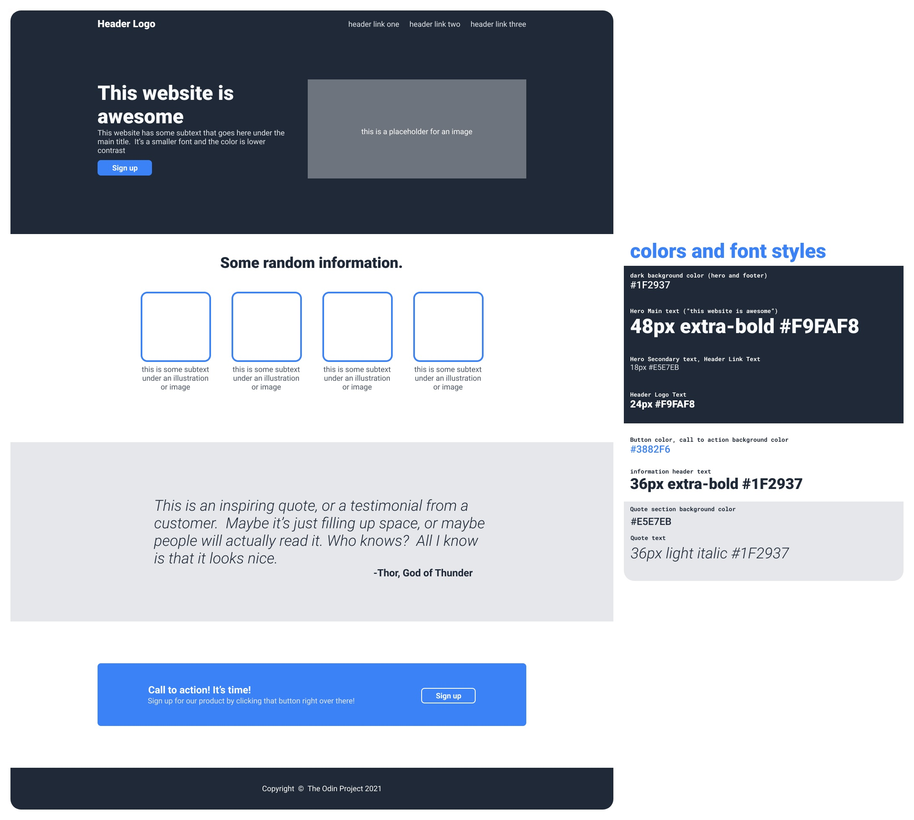

# The Odin Marina

This is a mockup design of a marina business Landing Page, titled as **The Odin Marina**.

For the best viewing experience, it is **recommended** to display the webpage on a desktop screen.

## Try it Out!

This project is hosted on GitHub Pages. Feel free to [try it out](https://raineedust.github.io/odin-landing-page/)!

## Inspiration

The design is heavily inspired by the following specs, with some minor additions:

## Motivation and Goals

This project is designed as part of The Odin Project's wonderful Web Development curriculum.

- [x] Use Flexbox
- [x] Use buttons
- [x] Develop basic design intuition
- [x] Use custom fonts and images
- [x] Provide assets credits

## Tech Stack:

-  HTML5
-  CSS

Built with :heart: to The Odin Project ~
