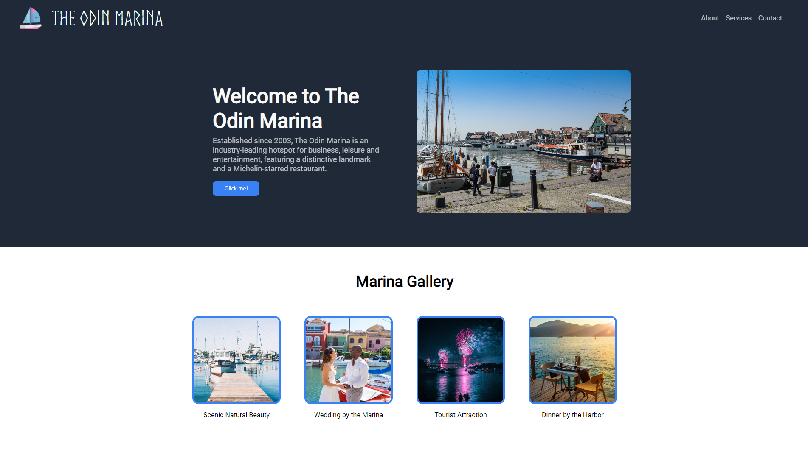

# The Odin Marina

This is a simple Landing Page for a fictitious business, **The Odin Marina**.

 

## Live Preview

This project is hosted on **GitHub Pages**. Feel free to [try it out](https://raineedust.github.io/the-odin-marina/)!

## Inspiration

The design is heavily inspired by the following specs, with some minor additions:

## Motivation and Goals

This project is designed as part of **The Odin Project's** wonderful Web Development curriculum.

- [x] Use Flexbox
- [x] Use buttons, hover effects
- [x] Develop basic design intuition
- [x] Use custom fonts and images
- [x] Provide assets credits

## Limitations

- Not fully optimized for mobile interfaces.

Built with :heart: to **The Odin Project** ~
